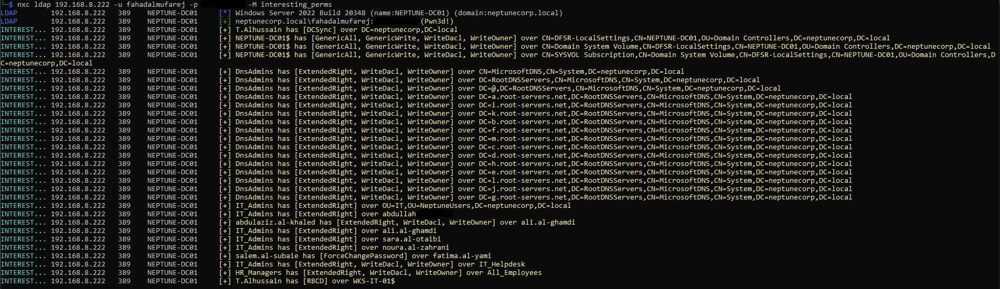

# nxc-interesting-permissions

Developed a custom NetExec module to audit Active Directory Permissions via LDAP. The tool identifies dangerous permissions while natively mapping SIDs to user principals for quick target recon.

It includes advanced features like `tokenGroups` unrolling to dynamically map inherited permissions through nested groups!

## Installing

Drop `interesting_perms.py` into your `~/.nxc/modules` directory.

## Usage

### Basic Scan
Scan the domain for interesting permissions. By default, this tool filters out default built-in objects (RIDs < 1000) to reduce noise.
`nxc ldap IP -u USER -p PASSWORD -M interesting_perms`



### Module Options

You can modify the module's behavior using the `-o` flag:

* **Show Built-in Objects (`builtin=1`)**
  Includes default Active Directory objects (like Domain Admins, Pre-Windows 2000, etc.) that are normally filtered out.


  `nxc ldap IP -u USER -p PASSWORD -M interesting_perms -o builtin=1`

* **Targeted Self-Audit (`self=1`)**
  Filters the output to *only* show permissions explicitly assigned to the user you authenticated with. Perfect for quick triage of a newly compromised account.

  
  `nxc ldap IP -u USER -p PASSWORD -M interesting_perms -o self=1`

* **Effective Nested Permissions (`tokengroup=1`)**
  Queries the Domain Controller for your `tokenGroups` to unroll all nested groups your user belongs to. It checks the ACLs against your massive list of inherited SIDs to uncover hidden escalation paths.

  
  `nxc ldap IP -u USER -p PASSWORD -M interesting_perms -o tokengroup=1`
  

*(Note: You can combine options like `-o self=1 builtin=1` if needed, though `tokengroup` handles its own logic automatically).*

## Permissions and Extended Rights

This module specifically hunts and parses the following high-value permissions:


```
GenericAll
GenericWrite
WriteDacl
WriteOwner
DCSync
ShadowCreds
RBCD
WriteMembers
WriteAccountRestrictions
WriteSPN
ReadLAPSPassword (LAPS)
ReadGMSAPassword
ReadBitLockerRecoveryKey
ForceChangePassword
ExtendedRight
```

# creds

This was inspired by https://powersploit.readthedocs.io/en/latest/Recon/Find-InterestingDomainAcl/


I just found it convenient to make it into a nxc module.
